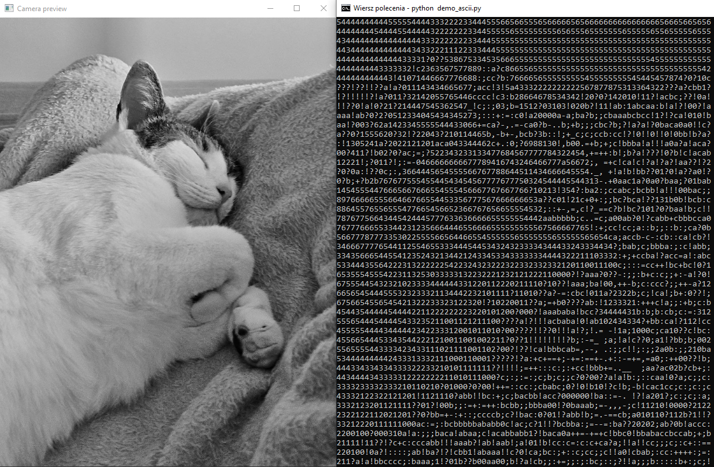
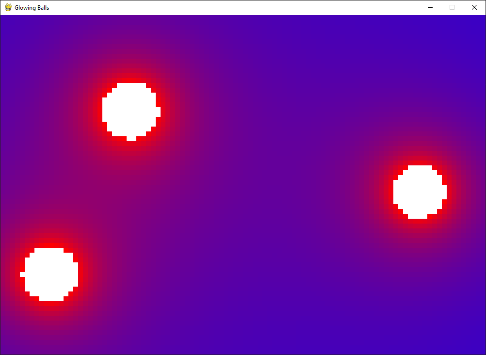
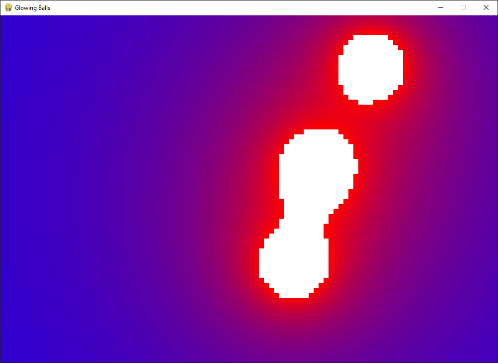

# Vision_Blob_2023
Quick test to check OpenCV Library and prepare know-how for future projects.

## main_ascii_camera
- Run the file _main_ascii_camera.py_ to convert your camera image into ascii image.
- Optionally you can use the _demo_ascii.py_ file to do this without using a camera.

  

## main_glowing_balls
- Quick project to check metaballs and color palette behavior.
- Run the file_main_glowing_balls.py_ to see bouncing glowing balls.

  
  

